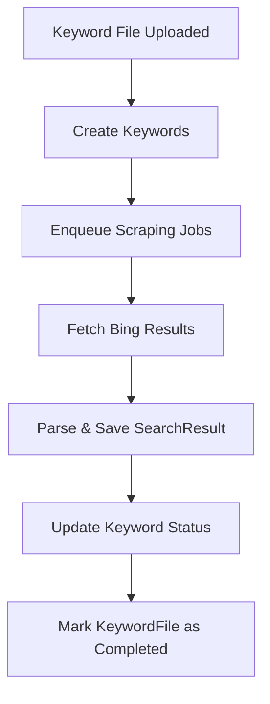

# 🕵️‍♂️ Bing Scraper

**Bing Scraper** is a Ruby on Rails application that automates the process of scraping search results from **Bing Search Engine**.
It allows you to upload batches of keywords, fetch structured search results, and store them for analysis.
Perfect for SEO monitoring, content research, or data-driven market analysis.

Visit: [https://dev.vicks-infinite.com/](https://dev.vicks-infinite.com/)

---

## ✨ Features

- 🔍 Manage keyword batches with `KeywordFile`
- ⚡ Asynchronous scraping using DelayedJob
- 🧩 Parse Bing results (title, URL, snippet, rank)
- 📦 Store structured results in PostgreSQL
- 📊 Track keyword progress (`pending`, `processing`, `complete`, `failed`)
- 🧠 Configurable scraping limits and delays
- 🧪 Tested with RSpec + Capybara
- 🧱 GitHub Actions CI integrated

---

## 🧰 Tech Stack

| Component | Description |
|------------|-------------|
| **Language** | Ruby 3.4.5 |
| **Framework** | Ruby on Rails 8 |
| **Database** | PostgreSQL |
| **Background Jobs** | DelayedJob |
| **Scraping** | Nokogiri + HTTParty or Selenium |
| **Testing** | RSpec + Capybara + FactoryBot |
| **CI/CD** | GitHub Actions |

---

## 🚀 Getting Started

### 1️⃣ Clone the project

```bash
git clone https://github.com/sokmesakhiev/scraper.git
cd scraper
```

### 2️⃣ Install dependencies

```bash
bundle install
```

### 3️⃣ Setup database

```bash
rails db:create db:migrate
```

(Optional) Load sample data:
```bash
rails db:seed
```

---

## 🧪 Usage

### Web Interface
Start the Rails server:

```bash
rails s
```

Visit: [http://localhost:3000](http://localhost:3000)

You can upload a `.csv` file containing keywords and monitor scraping progress directly in the dashboard.

---

## 📂 Data Model Overview

```
KeywordFile 1---N Keyword
```

| Model | Description |
|--------|-------------|
| **KeywordFile** | Represents a batch of uploaded keywords |
| **Keyword** | Individual search query with status tracking and scraping results |

---

## 🧠 Keyword Status

| Status | Description |
|---------|--------------|
| `pending` | Waiting to be scraped |
| `processing` | Currently scraping |
| `complete` | Successfully scraped |
| `failed` | Error or timeout |

---

## 🧩 Example Output

| Rank | Title | URL | Snippet |
|------|--------|-----|---------|
| 1 | Ruby on Rails Guides | https://guides.rubyonrails.org | The official Rails documentation. |
| 2 | RubyGems.org | https://rubygems.org | The Ruby community’s gem hosting service. |

---

## 🧱 Background Jobs

Scraping runs asynchronously using DelayedJob.

Start Jobs worker:

```bash
bin/delayed_job restart && rake jobs:work
```

---

## 🧪 Running Tests

Run the RSpec test suite:

```bash
bundle exec rspec
```

Run system tests (Selenium + Capybara):

```bash
bundle exec rspec spec/e2e
```

---

## 🧾 License

Released under the [MIT License](LICENSE).

---

## 👨‍💻 Author

**Sokmesa Khiev**
Lead Ruby on Rails Developer
🔗 [github.com/sokmesakhiev](https://github.com/sokmesakhiev)

---

## 📈 Workflow Overview (Mermaid Diagram)


